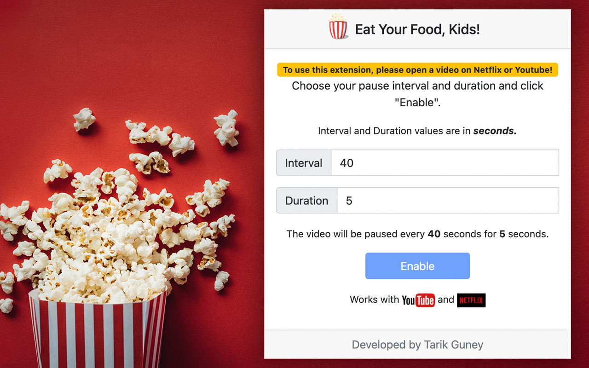

# Eat Your Food, Kids!

You are watching videos on YouTube or Netflix and wanting to automatically pause to the video from time to time to eat some snacks or take a break. Whatever your reasons are, Eat Your Food, Kids! is here to help.

## 🌟 Features

- **Scheduled Breaks**: Automatically pause content at intervals that work for you, ensuring you take regular breaks.
  
- **Mindful Eating**: Take proper meal breaks without the distraction of ongoing content.
  
- **Parental Control**: Help kids balance screen time with mealtime.
  
- **Health & Fitness**: Reminders to move around and not stay sedentary for too long.
  
- **Interactive Viewing**: Perfect for educational content - pause, reflect, and make notes.
  
- **Preventing Eye Strain**: Regular breaks can help reduce the risk of eye strain from prolonged screen time.
  
- **Adaptable Intervals**: Set up pause intervals to your preference.
  
- **Enhanced Viewing Experience**: Digest dramatic scenes or just give your mind a brief reset.
